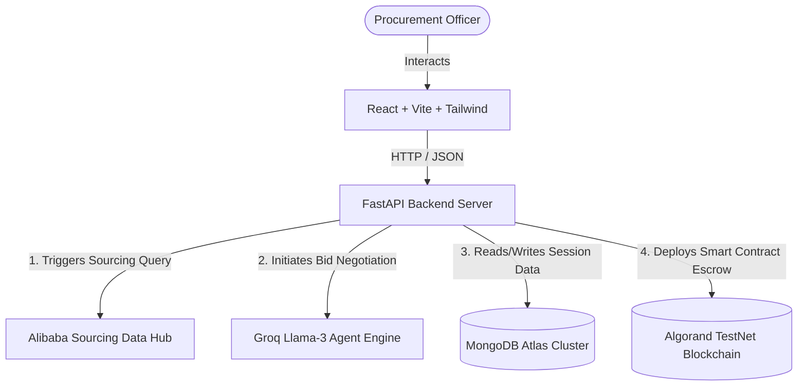

# ProcureAI Architecture Documentation

This document describes the design architecture, workflows, and technology integrations that power ProcureAI.

---

## 🗺️ System Overview Diagram

---

## 🧱 Key Architectural Layers

### 1. Frontend Client (React & Vite)
Provides an interactive dashboard for managing procurement cycles, negotiating with suppliers, and initiating on-chain transactions:
* **Dashboard View**: Displays active negotiations, supplier feeds, scorecard evaluations, and telemetry.
* **Agent Arena**: Visualizes multi-agent negotiation rounds and pricing concessions in real-time.
* **Pera Wallet Integration**: Bridges client-side transactions with the Algorand blockchain for secure wallet signature.

### 2. Backend Orchestrator (FastAPI)
The central nervous system of ProcureAI:
* **Service Architecture**: Deconstructs concerns into modular service engines (e.g., Translation Service, Email Service, Negotiation Intelligence, Analytics Engines).
* **Robust REST Routing**: Exposes lightweight endpoints for user sessions, sourcing queries, and escrow tracking.
* **M2M Sourcing Integration**: Automatically scrapes, detects, and transforms global supplier candidates into structured entities.

### 3. Database Layer (MongoDB)
* Keeps track of user registers, session configurations, and reputation records.
* Stores transaction IDs and smart contract application reference IDs mapped to active procurement orders.
* Restructures schemas dynamically to adapt to changing supplier metadata fields.

### 4. Smart Contract & Blockchain Layer (Algorand ARC-4)
Secures buyer and supplier commitments through cryptographic logic:
* **ARC-4 Python Contract**: An on-chain state machine written in Python (`algopy`), defining functions for fund locking, delivery verification, and release settlement.
* **Reputation Ledger**: Maps supplier deals and on-time performance directly on-chain using cryptographic hash digests, enabling verifiable reputation scores.
