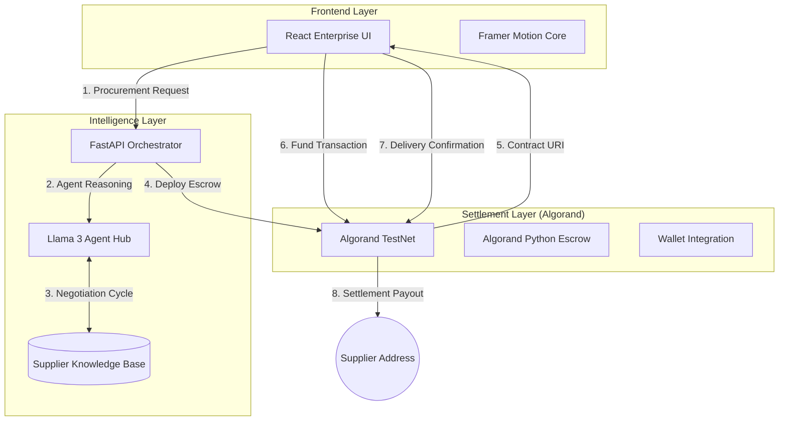
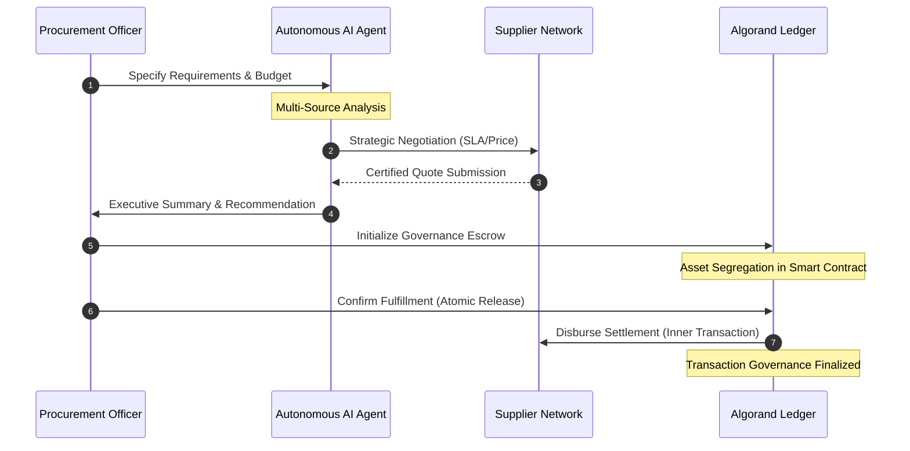

# ProcureAI: Autonomous Agentic Procurement Platform
### **Intelligent Sourcing, Strategic Negotiation, and Atomic Settlement on Algorand**

[](https://testnet.explorer.perawallet.app/)
[](https://opensource.org/licenses/MIT)
[](https://www.python.org/)
[](https://reactjs.org/)

---

## Executive Summary
**ProcureAI** is an enterprise-grade AI-powered **Supply Chain** platform designed to orchestrate the end-to-end procurement lifecycle. 

By leveraging autonomous AI agents for supplier discovery and multi-variable negotiation, integrated with **Trustless** escrow settlement on the **Algorand Blockchain**, ProcureAI eliminates manual inefficiencies and mitigates counterparty risk. The platform ensures optimal pricing and guaranteed delivery through **ARC4-compliant** on-chain contract execution.

---

## System Architecture

ProcureAI uses a simple but powerful setup:



---

## The Procurement Lifecycle

Our platform automates every step of the commerce journey, providing a truly "Agentic" experience.



---

## Key Innovations

### **1. Agent-to-Agent Commerce**
AI agents act as fiduciary proxies, orchestrating complex negotiations and quantitative supplier scoring, compressing procurement lead times from days to microseconds.

### **2. Strategic Negotiation Engine**
Leverages advanced LLMs (Llama 3) to execute counter-offers and evaluate trade-offs based on proprietary business logic and market volatility.

### **3. Algorand Governance Escrow**
A modular smart contract developed using **Algorand Python (Puya)** for secure, decentralized value retention.
*   **Asset Segregation**: Capital is isolated within a unique Application Address.
*   **Atomic Payouts**: Settlement is executed via Inner Transactions, triggered exclusively by verified fulfillment conditions.
*   **Verified Auditability**: Every state transition is recorded as a permanent Transaction on the ledger.

---

## Technology Stack

| Layer | Technology Specification |
| :--- | :--- |
| **User Interface** | React 18, Vite, Framer Motion, Lucide Architecture |
| **API Backbone** | FastAPI (Python), Asynchronous Orchestration |
| **On-Chain Logic** | Algorand Python (Puya), Algokit, Python SDK |
| **AI Intelligence** | Groq Core, Llama 3 (8B/70B models) |
| **Payment Gateway** | Pera Wallet Integration (TestNet) |

---

## Roadmap & Scalability
*   **Sector Agnostic**: Architecture supports Hardware, Logistics, and SaaS licensing.
*   **ERP Integration**: Designed for seamless connectivity with SAP and Oracle via API hooks.
*   **Transactional Visibility**: 100% of the procurement lifecycle—from initial negotiation to final Transaction settlement—is verifiable on the Algorand blockchain.

---

## Setup & Local Deployment

### **1. Backend & AI Orchestrator**
```bash
cd backend
python -m venv venv
venv\Scripts\activate  # Windows
pip install -r requirements.txt
uvicorn main:app --reload
```

### **2. Frontend Dashboard**
```bash
cd frontend
npm install
npm run dev
```

### **3. Smart Contract Governance**
```bash
cd smartcontract
poetry install
algokit compile python smart_contracts.escrow.contract
```

---

## License
This project is licensed under the MIT License - see the [LICENSE](LICENSE) file for details.

---

<div align="center">
**ProcureAI - Sourcing the Future of Commerce.**

*Built for the 2026 Algorand 3.0 Hackathon Series.*
</div>