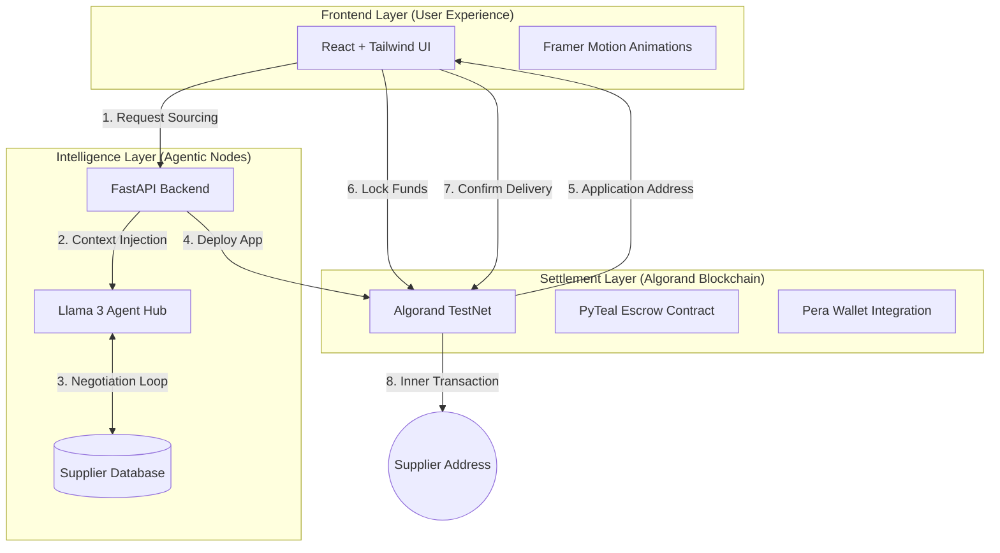
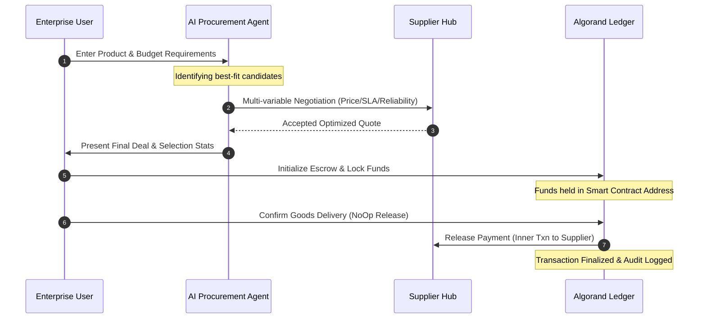

# ProcureAI
### **Autonomous On-Chain Procurement Engine**
*Elevating Global Trade through Agentic Intelligence & Algorand Finality*

[](https://testnet.explorer.perawallet.app/)
[](https://opensource.org/licenses/MIT)
[](https://www.python.org/)
[](https://reactjs.org/)

</div>

---

## 📖 Overview
**ProcureAI** is a futuristic fintech platform that solves the friction of traditional procurement using **Autonomous AI Agents** and **On-Chain Smart Contracts**. 

Small and Medium Enterprises (SMEs) often struggle with manual supplier sourcing, inefficient multi-round negotiations, and a lack of secure payment infrastructures. ProcureAI solves this by deploying specialized LLM-powered agents that source and negotiate deals in real-time, settling the final contract through an automated, trustless escrow system on the **Algorand Blockchain**.

---

## 🏗️ System Architecture

ProcureAI uses a modular architecture that separates intelligence from settlement, ensuring high efficiency and zero-trust security.



---

## 🔐 The Procurement Lifecycle

Our platform automates every step of the commerce journey, providing a truly "Agentic" experience.



---

## 🚀 Key Innovations

### **1. Agent-to-Agent Commerce**
AI agents act as fiduciary proxies, handling complex negotiations and supplier scoring without human intervention, reducing procurement cycles from days to seconds.

### **2. Autonomous Negotiation Hub**
Utilizes **Llama 3** via the Groq API to perform strategic counter-offers based on user-defined budgets and market data.

### **3. Algorand Smart Escrow (PyTeal)**
A state-of-the-art **Stateful Smart Contract** that acts as a secure, decentralized vault.
*   **Funds Protection**: ALGO is locked in an Application-unique address.
*   **Inner Transactions**: The contract securely executes the payout only when condition-checks (Buyer Confirmation) are met.
*   **Zero-Trust**: Neither party can access the funds unilaterally once locked.

---

## 🛠️ Technology Stack

| Layer | Technology |
| :--- | :--- |
| **Frontend** | React 18, Vite, Tailwind CSS, Framer Motion, Lucide Icons |
| **Backend** | FastAPI (Python), Uvicorn |
| **Blockchain** | Algorand TestNet, PyTeal, Algorand Python SDK |
| **AI Engine** | Groq Cloud, Llama 3 (8B/70B models) |
| **Wallet** | Pera Wallet (TestNet) |

---

## 📈 Scalability & Impact
*   **Industry Agnostic**: Can be deployed for Hardware, Agriculture, Logistics, and Software Licensing.
*   **Enterprise Ready**: Can integrate directly into existing ERP systems (SAP, Oracle) as a negotiation plugin.
*   **Audit-Ready**: 100% of the procurement lifecycle—from agent selection to final settlement—is verifiable on the Algorand ledger.

---

## 🛠️ Setup & Local Deployment

### **1. Prerequisites**
*   Node.js & npm (v18+)
*   Python 3.9+ 
*   An Algorand TestNet Mnemonic with some test ALGO.

### **2. Frontend Installation**
```bash
cd frontend
npm install
npm run dev
```

### **3. Backend Installation**
```bash
cd backend
python -m venv venv
source venv/bin/activate  # venv\Scripts\activate on Windows
pip install -r requirements.txt
uvicorn main:app --reload
```

### **4. Smart Contract Compilation**
```bash
cd backend
python smart_contract.py  # Generates .teal approval and clear programs
```

---

## 📄 License
This project is licensed under the MIT License - see the [LICENSE](LICENSE) file for details.

---

<div align="center">
**ProcureAI - Sourcing the Future of Commerce.**

*Built for the 2026 Algorand 3.0 Hackathon Series.*
</div>