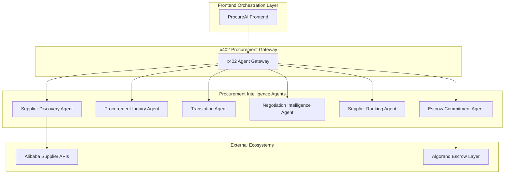
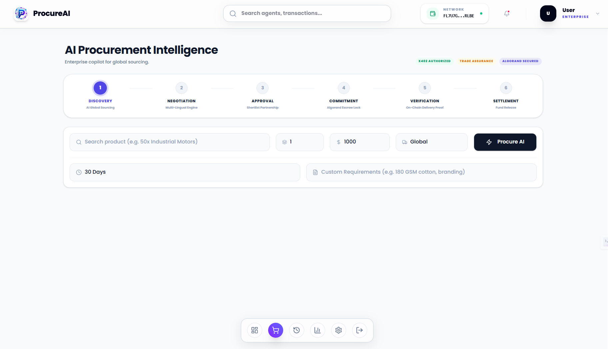
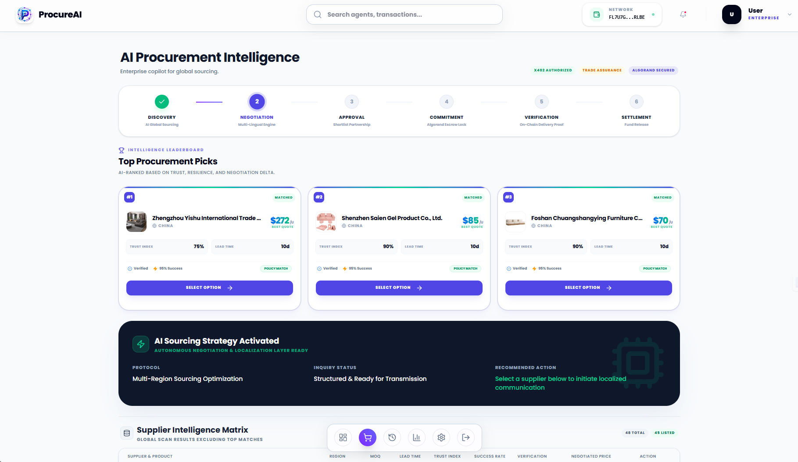
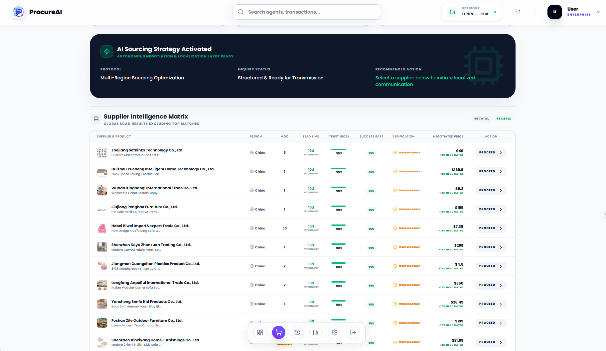
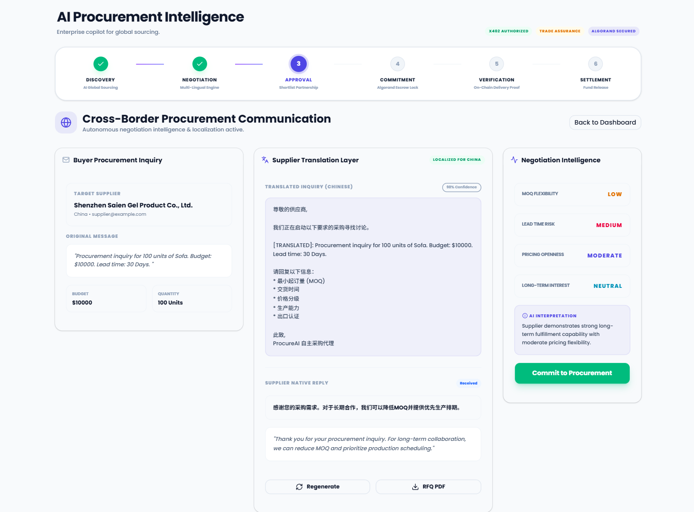
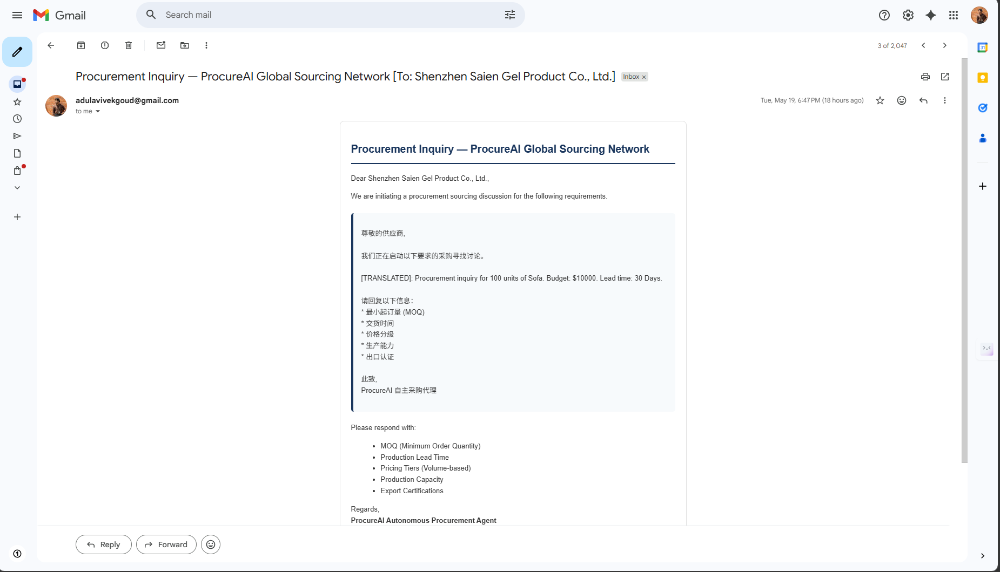

# ProcureAI: Modular AI Procurement Intelligence Infrastructure
### Autonomous Supplier Intelligence, Multilingual Procurement Negotiation & x402 Agent Infrastructure on Algorand

[](https://testnet.explorer.perawallet.app/)
[](https://opensource.org/licenses/MIT)
[](https://www.python.org/)
[](https://reactjs.org/)

---

## Executive Summary

ProcureAI is an AI-powered procurement orchestration platform and modular procurement intelligence infrastructure built for global sourcing workflows.

The platform combines reusable x402-powered procurement agents with multilingual supplier communication, AI-driven supplier intelligence, negotiation analysis, and blockchain-backed escrow commitments on Algorand.

Rather than replacing procurement marketplaces like Alibaba, ProcureAI acts as an intelligent procurement layer on top of existing supplier ecosystems.

The system enables businesses to:

* discover suppliers globally
* generate AI-powered procurement inquiries
* localize supplier communication
* analyze negotiation intelligence
* rank suppliers using trust & fulfillment scoring
* coordinate escrow-backed procurement settlements

Each procurement capability is designed as an independently reusable procurement intelligence agent that can later operate as a standalone x402 marketplace endpoint.

---

## Why ProcureAI?

Global procurement workflows are still highly manual.

Businesses often rely on:

* manual supplier comparison
* fragmented communication
* language translation tools
* spreadsheet-based evaluations
* multiple procurement coordinators
* slow RFQ negotiation cycles

ProcureAI introduces an AI-native procurement intelligence layer that automates supplier discovery, multilingual negotiation workflows, supplier trust analysis, and procurement orchestration.

The platform transforms procurement from a manual operational workflow into an AI-assisted intelligence system.

---

## System Architecture

ProcureAI uses a modular infrastructure powered by reusable agents:


```mermaid
graph TD

    subgraph "Frontend Orchestration Layer"
        UI[ProcureAI Frontend]
    end

    subgraph "x402 Procurement Gateway"
        GW[x402 Agent Gateway]
    end

    subgraph "Procurement Intelligence Agents"
        SDA[Supplier Discovery Agent]
        PIA[Procurement Inquiry Agent]
        TA[Translation Agent]
        NIA[Negotiation Intelligence Agent]
        SRA[Supplier Ranking Agent]
        ECA[Escrow Commitment Agent]
    end

    subgraph "External Ecosystems"
        ALI[Alibaba Supplier APIs]
        ALGO[Algorand Escrow Layer]
    end

    UI --> GW
    GW --> SDA
    GW --> PIA
    GW --> TA
    GW --> NIA
    GW --> SRA
    GW --> ECA

    SDA --> ALI
    ECA --> ALGO
```

---

## Procurement Intelligence Agents

ProcureAI is powered through modular procurement intelligence agents.

| Agent                          | Capability                                           |
| ------------------------------ | ---------------------------------------------------- |
| Supplier Discovery Agent       | Fetches suppliers from Alibaba ecosystems            |
| Translation Agent              | Localizes procurement communication                  |
| Procurement Inquiry Agent      | Generates AI-powered RFQs                            |
| Negotiation Intelligence Agent | Extracts MOQ & pricing flexibility                   |
| Supplier Ranking Agent         | Ranks suppliers using trust & fulfillment scoring    |
| Escrow Commitment Agent        | Coordinates blockchain-backed procurement settlement |
| Verification Agent             | Handles delivery verification workflows              |

These agents are designed to later operate independently as reusable x402 procurement endpoints.

---

## Autonomous Procurement Workflow Demonstration

Here is a step-by-step walkthrough of ProcureAI's autonomous procurement intelligence workflow in action:

### 1. AI Procurement Requirement Submission

Buyers enter procurement requirements including:
- product specifications
- quantity
- budget
- delivery timeline
- sourcing region
- custom manufacturing requirements

The Procurement Inquiry Agent structures sourcing requests before initiating supplier intelligence workflows.



### 2. AI Supplier Discovery & Intelligence Ranking

The Supplier Discovery Agent scans supplier ecosystems through Alibaba integrations and ranks suppliers using:
- trust scoring
- fulfillment analysis
- negotiation delta
- MOQ flexibility
- supplier verification signals

ProcureAI automatically recommends the highest-confidence procurement matches.



Below is the extended supplier scanning matrix generated by the agent:



### 3. Cross-Border Procurement Communication

The Translation Agent localizes procurement communication into supplier-native languages.

The Negotiation Intelligence Agent extracts:
- MOQ flexibility
- pricing openness
- delivery confidence
- long-term partnership intent

Supplier responses are automatically translated back into English for procurement operators.



### 4. Real Supplier Communication Workflow

ProcureAI sends AI-generated multilingual procurement inquiries directly to suppliers.

This demonstrates:
- operational procurement automation
- real-world supplier communication
- AI-generated RFQ orchestration
- multilingual sourcing execution



## Operational Workflow Summary

ProcureAI demonstrates a complete AI-assisted procurement lifecycle:

1. Procurement request generation
2. Global supplier discovery
3. AI supplier ranking
4. Multilingual supplier communication
5. Negotiation intelligence extraction
6. Escrow-backed procurement commitment
7. Delivery verification
8. Settlement execution on Algorand

---

## Business Model

ProcureAI supports multiple monetization layers:

- SaaS procurement subscriptions
- AI negotiation credits
- Procurement intelligence APIs
- Escrow transaction fees
- Enterprise procurement orchestration
- x402 pay-per-use procurement endpoints

---

## Future Vision

ProcureAI is evolving toward a modular procurement intelligence marketplace powered through reusable x402 endpoints.

Future roadmap includes:
- independently consumable procurement APIs
- procurement agent marketplace publishing
- ERP integrations
- supplier risk forecasting
- predictive procurement intelligence
- AI procurement copilots
- real-time logistics intelligence

---

## Key Innovations

### **1. Agent-to-Agent Commerce**
AI agents act as fiduciary proxies, orchestrating complex negotiations and quantitative supplier scoring, compressing procurement lead times from days to microseconds.

### **2. Strategic Negotiation Engine**
Leverages advanced LLMs to execute counter-offers and evaluate trade-offs based on proprietary business logic and supplier pricing elasticity.

### **3. Algorand Governance Escrow**
A modular smart contract developed using **Algorand Python (Puya)** for secure, decentralized value retention.
*   **Asset Segregation**: Capital is isolated within a unique Application Address.
*   **Atomic Payouts**: Settlement is executed via Inner Transactions, triggered exclusively by verified fulfillment conditions.
*   **Verified Auditability**: Every state transition is recorded as a permanent Transaction on the ledger.

---

## Technology Stack

| Layer | Technology Specification |
| :--- | :--- |
| **User Interface** | React 18, Vite, Framer Motion, Lucide Architecture |
| **API Backbone** | FastAPI (Python), Asynchronous Orchestration |
| **On-Chain Logic** | Algorand Python (Puya), Algokit, Python SDK |
| **AI Intelligence** | Groq Core, Llama 3 (8B/70B models) |
| **Payment Gateway** | Pera Wallet Integration (TestNet) |

---

## Project Structure

```text
frontend/       React + Vite frontend
backend/        FastAPI backend services
smartcontract/  Algorand smart contracts
tests/          Automated test suite
docs/           Architecture and deployment documentation
scripts/        Development and migration utilities
```

---

## Setup & Local Deployment

### **1. Backend & AI Orchestrator**
```bash
python -m venv venv
pip install -r requirements.txt

cd backend
venv\Scripts\activate
uvicorn main:app --reload
```

### **2. Frontend Dashboard**
```bash
cd frontend
npm install
npm run dev
```

### **3. Smart Contract Governance**
```bash
cd smartcontract
poetry install
algokit compile python smart_contracts.escrow.contract
```

---

## License
This project is licensed under the MIT License - see the [LICENSE](LICENSE) file for details.

---

<div align="center">
**ProcureAI — Building Modular Procurement Intelligence Infrastructure.**

*Powered through reusable x402 procurement intelligence agents.*
</div>