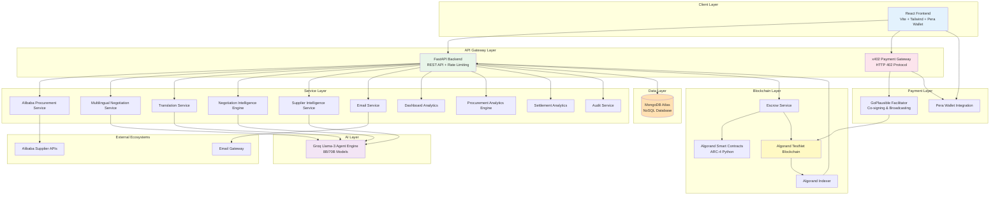

# ProcureAI: AI Procurement Intelligence Platform

An AI-powered procurement platform with supplier intelligence, multilingual negotiation, and blockchain-based escrow on Algorand.

[](https://testnet.explorer.perawallet.app/)
[](https://opensource.org/licenses/MIT)
[](https://www.python.org/)
[](https://reactjs.org/)

---

## What is ProcureAI?

ProcureAI is an AI platform that helps businesses find and work with suppliers globally. It sits on top of existing supplier ecosystems like Alibaba and adds intelligence to the procurement process.

The platform helps you:

- Find suppliers worldwide
- Generate procurement requests with AI
- Communicate in multiple languages
- Analyze negotiations
- Rank suppliers by reliability
- Handle payments through blockchain escrow

Each feature works as a separate agent that can be used independently.

---

## Why use ProcureAI?

Most procurement work is still done manually:

- Comparing suppliers by hand
- Scattered communication channels
- Using translation tools
- Managing spreadsheets
- Coordinating multiple people
- Slow negotiation cycles

ProcureAI automates supplier discovery, negotiations, and analysis. It turns manual procurement into an AI-assisted process.

---

## System Architecture

ProcureAI uses a modular system with reusable agents and blockchain escrow:


```mermaid
graph TB
    subgraph "Client Layer"
        UI[React Frontend<br/>Vite + Tailwind + Pera Wallet]
    end
    
    subgraph "API Gateway Layer"
        API[FastAPI Backend<br/>REST API + Rate Limiting]
        X402[x402 Payment Gateway<br/>HTTP 402 Protocol]
    end
    
    subgraph "Service Layer"
        S1[Alibaba Procurement Service]
        S2[Multilingual Negotiation Service]
        S3[Translation Service]
        S4[Negotiation Intelligence Engine]
        S5[Supplier Intelligence Service]
        S6[Email Service]
        S7[Dashboard Analytics]
        S8[Procurement Analytics Engine]
        S9[Settlement Analytics]
        S10[Audit Service]
    end
    
    subgraph "AI Layer"
        AI[Groq Llama-3 Agent Engine<br/>8B/70B Models]
    end
    
    subgraph "Blockchain Layer"
        SC[Algorand Smart Contracts<br/>ARC-4 Python]
        ESC[Escrow Service]
        BC[Algorand TestNet Blockchain]
        IDX[Algorand Indexer]
    end
    
    subgraph "Payment Layer"
        FAC[GoPlausible Facilitator<br/>Co-signing & Broadcasting]
        WAL[Pera Wallet Integration]
    end
    
    subgraph "Data Layer"
        DB[(MongoDB Atlas<br/>NoSQL Database)]
    end
    
    subgraph "External Ecosystems"
        ALI[Alibaba Supplier APIs]
        SMTP[Email Gateway]
    end
    
    UI --> API
    UI --> X402
    UI --> WAL
    
    API --> S1
    API --> S2
    API --> S3
    API --> S4
    API --> S5
    API --> S6
    API --> S7
    API --> S8
    API --> S9
    API --> S10
    API --> DB
    
    X402 --> FAC
    X402 --> WAL
    FAC --> BC
    
    S1 --> ALI
    S2 --> AI
    S3 --> AI
    S4 --> AI
    S5 --> AI
    S6 --> SMTP
    
    API --> ESC
    ESC --> SC
    ESC --> BC
    BC --> IDX
    IDX --> API
    
    style UI fill:#e3f2fd
    style API fill:#e8f5e9
    style X402 fill:#fce4ec
    style AI fill:#f3e5f5
    style BC fill:#fff9c4
    style DB fill:#ffe0b2
```

---

## Procurement Agents

ProcureAI uses these agents:

| Agent                          | Capability                                           |
| ------------------------------ | ---------------------------------------------------- |
| Supplier Discovery Agent       | Fetches suppliers from Alibaba ecosystems            |
| Translation Agent              | Localizes procurement communication                  |
| Procurement Inquiry Agent      | Generates AI-powered RFQs                            |
| Negotiation Intelligence Agent | Extracts MOQ & pricing flexibility                   |
| Supplier Ranking Agent         | Ranks suppliers using trust & fulfillment scoring    |
| Escrow Commitment Agent        | Coordinates blockchain-backed procurement settlement |
| Verification Agent             | Handles delivery verification workflows              |

These agents can work independently as separate services.

---

## How It Works

Here is how the procurement workflow works:

### 1. Submit Requirements

Enter what you need:
- Product details
- Quantity
- Budget
- Delivery date
- Location
- Custom requirements

The system structures your request and starts finding suppliers.


### 2. Find and Rank Suppliers

The system searches supplier databases and ranks them by:
- Trust score
- Delivery reliability
- Price flexibility
- Minimum order requirements
- Verification status

It shows you the best matches.


Below is the extended supplier scanning matrix generated by the agent:


### 3. Communicate with Suppliers

The system translates your requests into the supplier's language.

It analyzes supplier responses for:
- Minimum order flexibility
- Price negotiation room
- Delivery reliability
- Long-term partnership interest

Responses are translated back to English.


### 4. Send Inquiries

The system sends your requests to suppliers in their language.

This shows:
- Automated procurement
- Real supplier communication
- AI-generated requests
- Multilingual sourcing


## Workflow Summary

The complete process:

1. Create procurement request
2. Find suppliers globally
3. Rank suppliers with AI
4. Communicate in multiple languages
5. Analyze negotiations
6. Secure payment with escrow
7. Verify delivery
8. Complete settlement on blockchain

---

## Business Model

Revenue sources:

- Subscription plans
- Per-use AI credits
- API access
- Transaction fees
- Enterprise services
- Pay-per-use endpoints

---

## Future Plans

Upcoming features:

- Standalone procurement APIs
- Agent marketplace
- ERP system integration
- Risk prediction
- AI procurement assistants
- Real-time logistics tracking

---

## Key Features

### 1. Agent-Based Commerce
AI agents handle negotiations and supplier scoring automatically, speeding up procurement from days to minutes.

### 2. AI Negotiation Engine
Uses advanced language models to make counter-offers and evaluate trade-offs based on your business rules.

### 3. Algorand Escrow
Smart contracts on Algorand for secure payments:
- Funds are held separately
- Payments release only when conditions are met
- All transactions are recorded on the blockchain

---

## Technology Stack

| Layer | Technology |
| :--- | :--- |
| **User Interface** | React 18, Vite, Tailwind CSS |
| **API** | FastAPI (Python) |
| **Blockchain** | Algorand Python, Algokit |
| **AI** | Groq, Llama 3 |
| **Wallet** | Pera Wallet (TestNet) |

---

## Project Structure

```
frontend/       React frontend
backend/        FastAPI backend
smartcontract/  Algorand contracts
├── smart_contracts/
│   ├── escrow/
│   │   └── contract.py
│   ├── artifacts/
│   │   └── escrow/
│   └── __main__.py
tests/          Test suite
docs/           Documentation
```

**Note:** ProcureAI uses a production escrow contract on Algorand for procurement commitment and settlement workflows.

---

## Setup

### 1. Backend
```bash
python -m venv venv
pip install -r requirements.txt
cd backend
venv\Scripts\activate
uvicorn main:app --reload
```

### 2. Frontend
```bash
cd frontend
npm install
npm run dev
```

### 3. Smart Contracts
```bash
cd smartcontract
poetry install
algokit compile python smart_contracts.escrow.contract
```

---

## License
MIT License - see LICENSE file for details.

---

ProcureAI - AI-powered procurement platform.