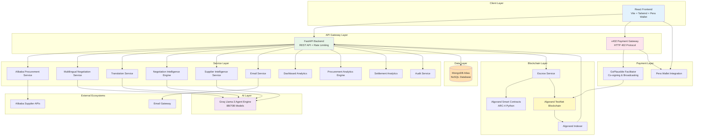
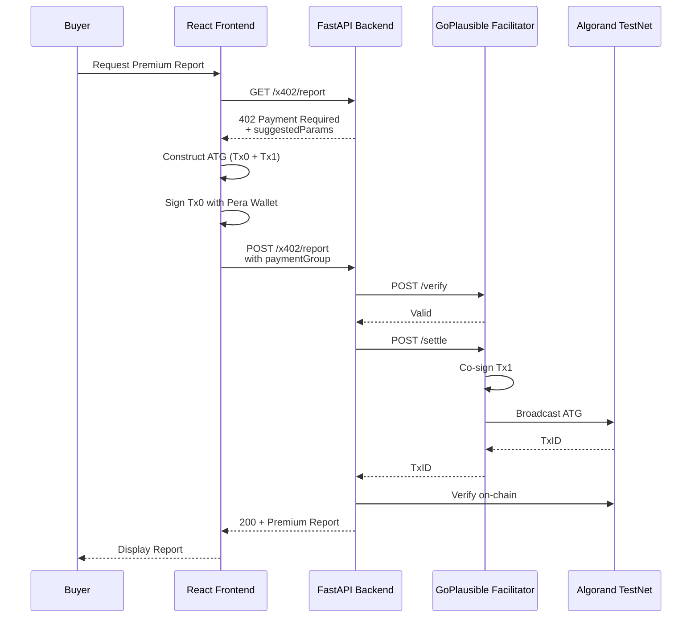
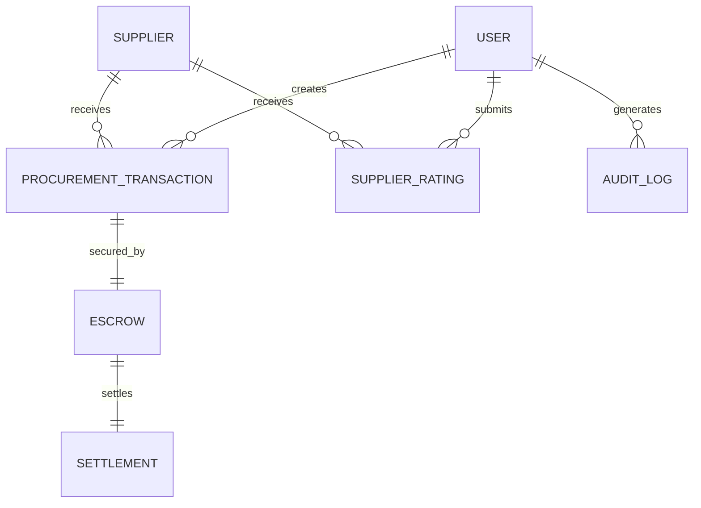
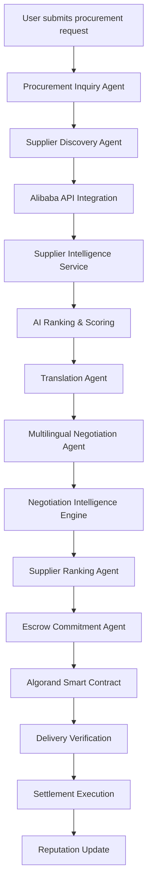
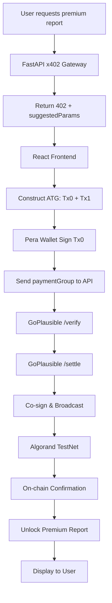

# ProcureAI Architecture Documentation

## System Architecture



## Component Architecture

### 1. Frontend Layer (React + Vite)

**Technology Stack:**
- React 18 with TypeScript
- Vite for build tooling
- Tailwind CSS v4 for styling
- Pera Wallet SDK for blockchain interactions
- React Router for navigation
- Recharts for data visualization
- Framer Motion for animations

**Key Components:**
- `Dashboard.tsx` - Main procurement dashboard
- `Procurement.tsx` - AI-powered procurement workflows
- `Analytics.tsx` - Advanced analytics and reporting
- `Transactions.tsx` - Blockchain transaction tracking
- `Admin.tsx` - Administrative controls
- `Settings.tsx` - User configuration
- `LiveDealArena.tsx` - Real-time negotiation visualization
- `X402PaymentStatus.tsx` - Payment gateway integration

**UI Component Library:**
- Dashboard components (metrics, charts, tables)
- Procurement components (forms, supplier cards, negotiation panels)
- UI components (buttons, inputs, modals, toasts)

### 2. Backend API Layer (FastAPI)

**Technology Stack:**
- FastAPI 0.135.1 with async support
- Uvicorn ASGI server
- Pydantic for data validation
- JWT authentication with bcrypt
- Rate limiting with slowapi
- CORS middleware for frontend integration

**Core Services:**

#### AI & Intelligence Services
- `ai_agent.py` - AI agent orchestration and supplier selection
- `alibaba_procurement_service.py` - Alibaba API integration (11,970 bytes)
- `multilingual_negotiation_service.py` - Cross-border negotiation (31,872 bytes)
- `translation_service.py` - Multi-language support (7,097 bytes)
- `negotiation_intelligence.py` - MOQ & pricing analysis (10,048 bytes)
- `supplier_intelligence_service.py` - Supplier ranking (8,538 bytes)

#### Analytics & Reporting
- `dashboard_analytics.py` - Real-time dashboard metrics (7,774 bytes)
- `procurement_analytics_engine.py` - Advanced analytics (16,059 bytes)
- `procurement_insights.py` - Business intelligence (6,987 bytes)
- `settlement_analytics.py` - Settlement tracking (12,681 bytes)

#### Communication & Operations
- `email_service.py` - Email notifications (5,478 bytes)
- `procurement_message_engine.py` - Message orchestration (2,860 bytes)
- `audit_service.py` - Audit logging (8,069 bytes)
- `global_procurement_engine.py` - Global sourcing (11,419 bytes)

### 3. Blockchain Layer (Algorand)

**Technology Stack:**
- Algorand Python (Puya) - ARC-4 smart contracts
- PyTeal 0.27.0 - TEAL compilation
- py-algorand-sdk 2.11.1 - Blockchain interactions
- Algokit 2.10.2 - Development toolkit

**Smart Contract Architecture:**
```
smartcontract/
├── smart_contracts/
│   ├── escrow/
│   │   ├── contract.py          # Main escrow logic
│   │   ├── approval.py          # State machine
│   │   └── clear_state.py       # Storage schema
│   └── artifacts/               # Compiled TEAL
└── .algokit.toml                # Configuration
```

**Blockchain Services:**
- `blockchain.py` - Transaction creation (1,640 bytes)
- `escrow.py` - Escrow logic (1,784 bytes)
- `escrow_client.py` - Escrow client (69,590 bytes)
- `escrow_service.py` - Escrow deployment (5,100 bytes)
- `smart_contract.py` - Contract management (2,630 bytes)

**Key Features:**
- Asset segregation in unique Application Address
- Atomic payouts via Inner Transactions
- On-chain reputation ledger
- Delivery verification & release settlement

### 4. x402 Payment Gateway

**Architecture:**


**Payment Flow:**
1. **Challenge**: Server returns 402 with payment requirements
2. **ATG Construction**: Client builds Atomic Transaction Group
   - Tx0: USDC transfer (buyer → treasury, fee=0)
   - Tx1: Fee payment (facilitator → self, fee=2000)
3. **Signature Separation**: Buyer signs only Tx0 via Pera Wallet
4. **Facilitator Co-signing**: GoPlausible signs Tx1 and broadcasts
5. **Verification**: Server confirms on-chain settlement
6. **Resource Unlock**: Premium content delivered

### 5. Database Layer (MongoDB Atlas)

**Current Collections:**
- `users` - Authentication & user profiles
- `escrows` - Blockchain escrow tracking

**Planned Collections:**
- `suppliers` - Supplier registry
- `procurement_transactions` - Transaction records
- `settlements` - Settlement history
- `supplier_ratings` - Reputation system
- `audit_logs` - Audit trail

**Schema Relationships:**


### 6. AI Intelligence Layer

**Technology Stack:**
- Groq SDK 1.1.1
- Llama-3 8B/70B models
- Agent orchestration framework

**AI Capabilities:**
- Supplier discovery & ranking
- Multilingual negotiation
- MOQ & pricing flexibility analysis
- Procurement inquiry generation
- Trust scoring algorithms
- Delivery confidence prediction

## Data Flow

### Procurement Workflow


### x402 Payment Flow


## Technology Stack Summary

| Layer | Technology | Purpose |
|-------|-----------|---------|
| **Frontend** | React 18, Vite, Tailwind CSS | User interface & interactions |
| **Wallet** | Pera Wallet SDK | Blockchain transaction signing |
| **Backend** | FastAPI, Uvicorn, Pydantic | REST API & orchestration |
| **AI** | Groq Llama-3 8B/70B | Intelligence & negotiation |
| **Blockchain** | Algorand Python (Puya), PyTeal | Smart contracts & escrow |
| **Database** | MongoDB Atlas | Data persistence |
| **Payment** | x402 Protocol, GoPlausible | Pay-per-use API access |
| **External** | Alibaba APIs, Email Gateway | Supplier data & communication |

## Project Structure

```
APP/
├── frontend/                    # React + Vite frontend
│   ├── src/
│   │   ├── components/         # UI components
│   │   ├── pages/             # Page components
│   │   ├── lib/               # Utilities
│   │   └── context/           # React context
│   ├── package.json
│   └── vite.config.ts
├── backend/                     # FastAPI backend
│   ├── main.py                # API entry point
│   ├── ai/                    # AI services
│   ├── blockchain/            # Blockchain services
│   ├── database/              # Database models
│   ├── services/              # Business logic
│   ├── x402/                  # Payment gateway
│   └── requirements.txt
├── smartcontract/              # Algorand smart contracts
│   ├── smart_contracts/
│   │   └── escrow/           # Escrow contract
│   └── pyproject.toml
├── tests/                      # Test suite
├── docs/                       # Documentation
│   ├── ARCHITECTURE.md
│   ├── DATABASE_DESIGN.md
│   ├── X402_ARCHITECTURE.md
│   └── X402_FLOW.md
└── README.md
```

## Security Features

- JWT authentication with bcrypt password hashing
- Rate limiting with slowapi
- CORS configuration
- Signature separation (buyer/facilitator)
- On-chain transaction verification
- Audit logging service
- Environment variable configuration

## Deployment Architecture

**Development:**
- Frontend: `npm run dev` (Vite dev server)
- Backend: `uvicorn main:app --reload` 
- Smart Contracts: `algokit compile python` 

**Production:**
- Frontend: Vercel deployment
- Backend: Containerized FastAPI
- Database: MongoDB Atlas
- Blockchain: Algorand TestNet
- Payment: GoPlausible hosted facilitator

This architecture provides a modular foundation for AI-powered procurement with blockchain escrow.
