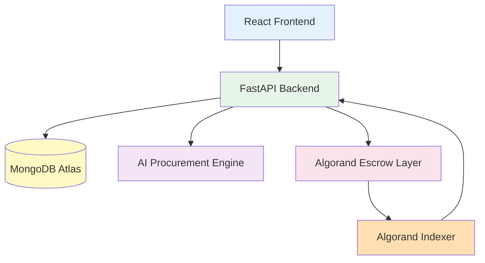
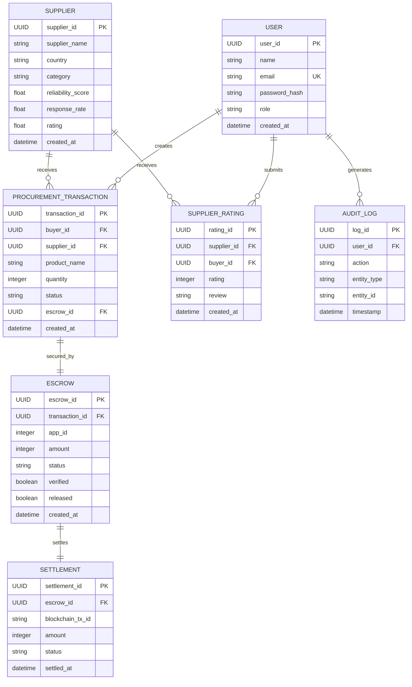

# ProcureAI Database Design

**Algorand Hackathon - Technical Documentation**

---

## Architecture Context

ProcureAI uses MongoDB Atlas as the database. It connects to multiple service layers:



---

## Section 1: Database Overview

ProcureAI uses MongoDB Atlas as its primary database, providing a flexible NoSQL schema that scales with the platform's growth. The current implementation includes two core collections (`users` and `escrows`) that support authentication and blockchain escrow functionality. The production-ready design expands to seven additional collections for comprehensive supplier management, transaction tracking, settlement processing, reputation systems, and audit logging.

The database architecture follows a document-oriented approach, enabling rapid iteration during development while maintaining query performance through strategic indexing. MongoDB's horizontal scaling capabilities support future growth as the platform handles increased transaction volumes and user activity.

---

## Section 2: Collection Schema Definitions

### User

```json
{
  "_id": "ObjectId",
  "user_id": "UUID (Primary Key)",
  "name": "String",
  "email": "String (Unique)",
  "password_hash": "String (bcrypt)",
  "role": "String (buyer/supplier/admin)",
  "created_at": "DateTime"
}
```

### Supplier

```json
{
  "_id": "ObjectId",
  "supplier_id": "UUID (Primary Key)",
  "supplier_name": "String",
  "country": "String",
  "category": "String",
  "reliability_score": "Float (0-100)",
  "response_rate": "Float (0-100)",
  "rating": "Float (0-5)",
  "created_at": "DateTime"
}
```

### ProcurementTransaction

```json
{
  "_id": "ObjectId",
  "transaction_id": "UUID (Primary Key)",
  "buyer_id": "UUID (Foreign Key → users)",
  "supplier_id": "UUID (Foreign Key → suppliers)",
  "product_name": "String",
  "quantity": "Integer",
  "status": "String (draft/negotiating/confirmed/in_transit/completed/cancelled)",
  "escrow_id": "UUID (Foreign Key → escrows)",
  "created_at": "DateTime"
}
```

### Escrow

```json
{
  "_id": "ObjectId",
  "escrow_id": "UUID (Primary Key)",
  "transaction_id": "UUID (Foreign Key → procurement_transactions)",
  "app_id": "Integer (Algorand Application ID)",
  "amount": "Integer (MicroAlgos)",
  "status": "String (pending/locked/released/cancelled)",
  "verified": "Boolean",
  "released": "Boolean",
  "created_at": "DateTime"
}
```

### Settlement

```json
{
  "_id": "ObjectId",
  "settlement_id": "UUID (Primary Key)",
  "escrow_id": "UUID (Foreign Key → escrows)",
  "blockchain_tx_id": "String (Algorand Transaction ID)",
  "amount": "Integer (MicroAlgos)",
  "status": "String (pending/confirmed/failed)",
  "settled_at": "DateTime"
}
```

### SupplierRating

```json
{
  "_id": "ObjectId",
  "rating_id": "UUID (Primary Key)",
  "supplier_id": "UUID (Foreign Key → suppliers)",
  "buyer_id": "UUID (Foreign Key → users)",
  "rating": "Integer (1-5)",
  "review": "String",
  "created_at": "DateTime"
}
```

### AuditLog

```json
{
  "_id": "ObjectId",
  "log_id": "UUID (Primary Key)",
  "user_id": "UUID (Foreign Key → users)",
  "action": "String",
  "entity_type": "String",
  "entity_id": "String",
  "timestamp": "DateTime"
}
```

---

## Section 3: Collection Relationship Diagram



---

## Section 4: Current vs Future Collections

| Collection               | Status  |
| ------------------------ | ------- |
| users                    | Current |
| escrows                  | Current |
| suppliers                | Planned |
| procurement_transactions | Planned |
| settlements              | Planned |
| supplier_ratings         | Planned |
| audit_logs               | Planned |

---

## Section 5: Backend Architecture Diagram


---

## Section 6: Scalability Notes

### MongoDB Indexing Strategy
- **Unique Indexes**: `users.email`, `suppliers.supplier_id` for data integrity
- **Compound Indexes**: `procurement_transactions.buyer_id + status`, `escrows.app_id + status` for query optimization
- **TTL Indexes**: `audit_logs.timestamp` for automatic log rotation (90-day retention)

### Escrow Transaction Storage
- Escrow documents store minimal on-chain references (`app_id`, `amount`) to reduce database size
- Full transaction details retrieved via Algorand Indexer on-demand
- Settlement records linked to escrows for complete audit trail

### Audit Logging
- Asynchronous write operations to prevent blocking main application flow
- Batch insertion for high-volume events
- Immutable log entries with append-only pattern

### Supplier Reputation System
- Cached `rating` and `reliability_score` fields updated on rating changes
- Background recalculation jobs for score aggregation
- Read-optimized schema for fast supplier ranking queries

### Cached Algorand Indexer Queries
- Redis caching layer for frequently accessed blockchain data
- Cache invalidation on new block confirmations
- Reduced indexer API calls for cost optimization

### Future Horizontal Scaling Support
- Shard key strategy: `buyer_id` for user-centric data distribution
- Read replicas for analytics queries without impacting write performance
- Connection pooling with PyMongo for efficient database access
