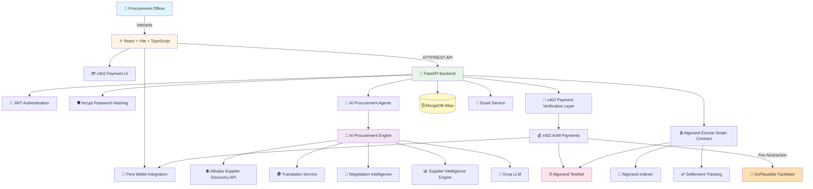
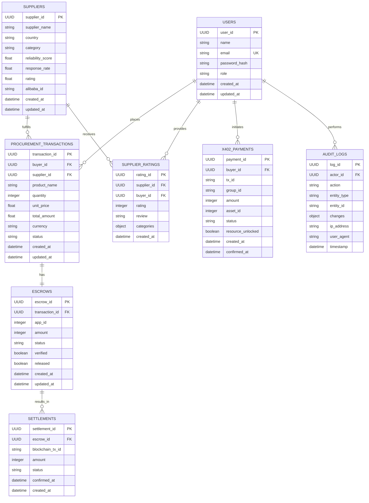
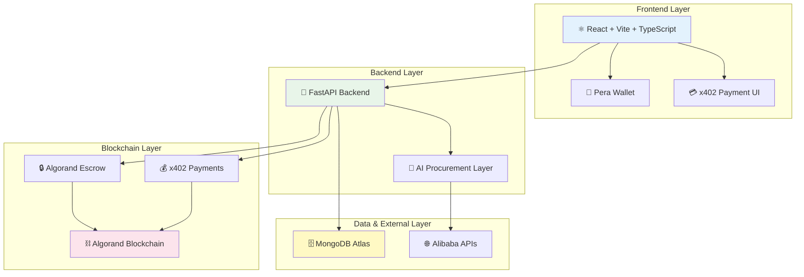
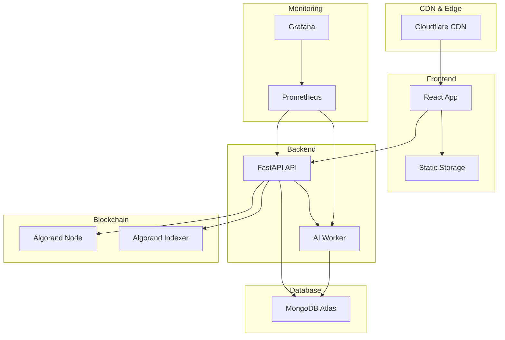

# ProcureAI System Architecture and Database Design

**Algorand Semi-Final Technical Judges Documentation**

---

## 1. Complete System Architecture Diagram

### 1.1 High-Level System Flow



### 1.2 Detailed Component Interactions

#### Frontend Layer
- **React + Vite + TypeScript**: Modern, type-safe frontend framework
- **Pera Wallet Integration**: Secure Algorand wallet connection for transaction signing
- **x402 Payment UI**: Specialized interface for payment-gated API access

#### Backend Layer
- **FastAPI**: High-performance Python web framework
- **JWT Authentication**: Token-based authentication system
- **bcrypt Password Hashing**: Secure password storage
- **AI Procurement Agents**: Autonomous agents for sourcing and negotiation
- **x402 Payment Verification Layer**: Validates on-chain payments before resource access

#### AI Procurement Engine
- **Alibaba Supplier Discovery API**: Global supplier database integration
- **Translation Service**: Multi-language communication support
- **Negotiation Intelligence**: AI-powered price optimization
- **Supplier Intelligence Engine**: Supplier reliability and performance analysis
- **Groq LLM**: Large language model for natural language processing

#### Database Layer
- **MongoDB Atlas**: Cloud-native NoSQL database for flexible schema

#### Blockchain Layer
- **Algorand Escrow Smart Contract**: Trustless fund locking and release
- **x402 AVM Payments**: Atomic transaction groups for fee abstraction
- **Algorand TestNet**: Development blockchain network
- **Algorand Indexer**: Blockchain data indexing and querying
- **Settlement Tracking**: On-chain transaction monitoring

#### External Services
- **Email Service**: Notification system
- **GoPlausible Facilitator**: x402 payment facilitation service

---

## 2. Database Design

### 2.1 Current Collections

#### Users Collection
```json
{
  "_id": "ObjectId",
  "user_id": "UUID (Primary Key)",
  "name": "String",
  "email": "String (Unique)",
  "password_hash": "String (bcrypt)",
  "role": "String (buyer/admin/supplier)",
  "created_at": "DateTime",
  "updated_at": "DateTime"
}
```

#### Escrows Collection
```json
{
  "_id": "ObjectId",
  "escrow_id": "UUID (Primary Key)",
  "transaction_id": "UUID (Foreign Key)",
  "app_id": "Integer (Algorand Application ID)",
  "amount": "Integer (MicroAlgos)",
  "status": "String (pending/locked/released/cancelled)",
  "verified": "Boolean",
  "released": "Boolean",
  "created_at": "DateTime",
  "updated_at": "DateTime"
}
```

### 2.2 Future Production Collections

#### Suppliers Collection
```json
{
  "_id": "ObjectId",
  "supplier_id": "UUID (Primary Key)",
  "supplier_name": "String",
  "country": "String",
  "category": "String",
  "reliability_score": "Float (0-100)",
  "response_rate": "Float (0-100)",
  "rating": "Float (0-5)",
  "alibaba_id": "String",
  "created_at": "DateTime",
  "updated_at": "DateTime"
}
```

#### Procurement Transactions Collection
```json
{
  "_id": "ObjectId",
  "transaction_id": "UUID (Primary Key)",
  "buyer_id": "UUID (Foreign Key → users)",
  "supplier_id": "UUID (Foreign Key → suppliers)",
  "product_name": "String",
  "quantity": "Integer",
  "unit_price": "Float",
  "total_amount": "Float",
  "currency": "String",
  "status": "String (draft/negotiating/confirmed/in_transit/completed/cancelled)",
  "created_at": "DateTime",
  "updated_at": "DateTime"
}
```

#### Settlements Collection
```json
{
  "_id": "ObjectId",
  "settlement_id": "UUID (Primary Key)",
  "escrow_id": "UUID (Foreign Key → escrows)",
  "blockchain_tx_id": "String (Algorand Transaction ID)",
  "amount": "Integer (MicroAlgos)",
  "status": "String (pending/confirmed/failed)",
  "confirmed_at": "DateTime",
  "created_at": "DateTime"
}
```

#### Supplier Ratings Collection
```json
{
  "_id": "ObjectId",
  "rating_id": "UUID (Primary Key)",
  "supplier_id": "UUID (Foreign Key → suppliers)",
  "buyer_id": "UUID (Foreign Key → users)",
  "rating": "Integer (1-5)",
  "review": "String",
  "categories": {
    "quality": "Integer (1-5)",
    "delivery": "Integer (1-5)",
    "communication": "Integer (1-5)",
    "pricing": "Integer (1-5)"
  },
  "created_at": "DateTime"
}
```

#### Audit Logs Collection
```json
{
  "_id": "ObjectId",
  "log_id": "UUID (Primary Key)",
  "actor_id": "UUID (Foreign Key → users)",
  "action": "String",
  "entity_type": "String",
  "entity_id": "String",
  "changes": "Object (Before/After state)",
  "ip_address": "String",
  "user_agent": "String",
  "timestamp": "DateTime"
}
```

#### X402 Payments Collection
```json
{
  "_id": "ObjectId",
  "payment_id": "UUID (Primary Key)",
  "buyer_id": "UUID (Foreign Key → users)",
  "tx_id": "String (Algorand Transaction ID)",
  "group_id": "String (Atomic Transaction Group ID)",
  "amount": "Integer (MicroAlgos)",
  "asset_id": "Integer (Algorand Asset ID, 0 for ALGO)",
  "status": "String (pending/confirmed/failed/refunded)",
  "resource_unlocked": "Boolean",
  "created_at": "DateTime",
  "confirmed_at": "DateTime"
}
```

### 2.3 Entity Relationships Summary

| Entity | Primary Key | Foreign Keys | Indexes |
|--------|-------------|--------------|---------|
| users | user_id | - | email (unique) |
| suppliers | supplier_id | - | alibaba_id, category |
| procurement_transactions | transaction_id | buyer_id, supplier_id | buyer_id, supplier_id, status |
| escrows | escrow_id | transaction_id | transaction_id, app_id, status |
| settlements | settlement_id | escrow_id | escrow_id, blockchain_tx_id |
| supplier_ratings | rating_id | supplier_id, buyer_id | supplier_id, buyer_id |
| audit_logs | log_id | actor_id | actor_id, timestamp, entity_type |
| x402_payments | payment_id | buyer_id | buyer_id, tx_id, status |

---

## 3. Mermaid ER Diagram



---

## 4. Collection Relationships

### 4.1 User → ProcurementTransaction
- **Relationship**: One-to-Many
- **Description**: A single user (buyer) can place multiple procurement transactions
- **Foreign Key**: `buyer_id` in `procurement_transactions` references `user_id` in `users`
- **Cardinality**: 1:N

### 4.2 ProcurementTransaction → Supplier
- **Relationship**: Many-to-One
- **Description**: Multiple procurement transactions can be associated with a single supplier
- **Foreign Key**: `supplier_id` in `procurement_transactions` references `supplier_id` in `suppliers`
- **Cardinality**: N:1

### 4.3 ProcurementTransaction → Escrow
- **Relationship**: One-to-One
- **Description**: Each procurement transaction has exactly one associated escrow for fund security
- **Foreign Key**: `transaction_id` in `escrows` references `transaction_id` in `procurement_transactions`
- **Cardinality**: 1:1

### 4.4 Escrow → Settlement
- **Relationship**: One-to-Many
- **Description**: A single escrow can result in multiple settlement attempts (e.g., partial releases)
- **Foreign Key**: `escrow_id` in `settlements` references `escrow_id` in `escrows`
- **Cardinality**: 1:N

### 4.5 User → SupplierRating
- **Relationship**: One-to-Many
- **Description**: A single user can provide multiple ratings for different suppliers
- **Foreign Key**: `buyer_id` in `supplier_ratings` references `user_id` in `users`
- **Cardinality**: 1:N

### 4.6 SupplierRating → Supplier
- **Relationship**: Many-to-One
- **Description**: Multiple ratings can be provided for a single supplier
- **Foreign Key**: `supplier_id` in `supplier_ratings` references `supplier_id` in `suppliers`
- **Cardinality**: N:1

### 4.7 User → X402Payment
- **Relationship**: One-to-Many
- **Description**: A single user can initiate multiple x402 payments for API access
- **Foreign Key**: `buyer_id` in `x402_payments` references `user_id` in `users`
- **Cardinality**: 1:N

### 4.8 User → AuditLog
- **Relationship**: One-to-Many
- **Description**: A single user can perform multiple actions that are logged
- **Foreign Key**: `actor_id` in `audit_logs` references `user_id` in `users`
- **Cardinality**: 1:N

---

## 5. PNG-Ready Technical Judge Diagram

### 5.1 Simplified Architecture for Presentation



### 5.2 ASCII Art Version (for direct copy-paste)

```
┌─────────────────────────────────────────────────────────────────┐
│                     FRONTEND LAYER                              │
│  ┌──────────────┐  ┌──────────────┐  ┌──────────────┐         │
│  │ React + Vite │  │ Pera Wallet  │  │ x402 Payment │         │
│  │   + TypeScript│  │ Integration  │  │      UI      │         │
│  └──────┬───────┘  └──────────────┘  └──────────────┘         │
└─────────┼──────────────────────────────────────────────────────┘
          │
          ▼
┌─────────────────────────────────────────────────────────────────┐
│                    BACKEND LAYER                                │
│  ┌──────────────┐  ┌──────────────────────────────────────┐   │
│  │  FastAPI     │  │      AI Procurement Layer           │   │
│  │   Backend    │  │  • Alibaba Supplier Discovery       │   │
│  │              │  │  • Translation Service              │   │
│  │  • JWT Auth  │  │  • Negotiation Intelligence         │   │
│  │  • bcrypt    │  │  • Supplier Intelligence Engine    │   │
│  └──────┬───────┘  └──────────────────────────────────────┘   │
└─────────┼──────────────────────────────────────────────────────┘
          │
          ├──────────────────┐
          ▼                  ▼
┌──────────────────┐  ┌──────────────────┐
│  DATABASE LAYER  │  │ BLOCKCHAIN LAYER  │
│  ┌────────────┐  │  │  ┌────────────┐  │
│  │  MongoDB   │  │  │  │  Algorand  │  │
│  │   Atlas    │  │  │  │  Escrow    │  │
│  └────────────┘  │  │  └─────┬──────┘  │
│                  │  │        │         │
│                  │  │  ┌─────▼──────┐  │
│                  │  │  │   x402     │  │
│                  │  │  │  Payments  │  │
│                  │  │  └─────┬──────┘  │
│                  │  │        │         │
│                  │  │  ┌─────▼──────┐  │
│                  │  │  │  Algorand  │  │
│                  │  │  │ Blockchain │  │
│                  │  │  └────────────┘  │
└──────────────────┘  └──────────────────┘
```

---

## 6. Current vs Future Implementation

### 6.1 Implementation Comparison Table

| Component | Current Implementation | Future Production Implementation |
|-----------|----------------------|----------------------------------|
| **Database Collections** | Users, Escrows | Users, Suppliers, Procurement Transactions, Escrows, Settlements, Supplier Ratings, Audit Logs, X402 Payments |
| **Authentication** | JWT Authentication | JWT + OAuth 2.0 + Multi-factor Authentication |
| **Password Security** | bcrypt hashing | bcrypt + Argon2 + Password policies |
| **Payment System** | x402 Payments (Basic) | x402 Payments + Multi-asset support + Refund mechanisms |
| **Smart Contracts** | Algorand Escrow (Basic) | Advanced Escrow + Multi-signature + Time-locked releases |
| **AI Capabilities** | Basic Negotiation Agent | Multi-agent system + Reinforcement learning + Predictive analytics |
| **Supplier Discovery** | Alibaba API Integration | Multi-platform sourcing (Alibaba, Global Sources, ThomasNet) |
| **Rating System** | Not implemented | Comprehensive supplier rating system with weighted categories |
| **Audit Trail** | Not implemented | Complete audit logging with immutable blockchain records |
| **Admin Dashboard** | Basic UI | Advanced admin panel with analytics and reporting |
| **Analytics Layer** | Not implemented | Real-time analytics + Business intelligence + ML insights |
| **Enterprise APIs** | Not implemented | RESTful API + GraphQL + Webhook integrations |
| **Compliance** | Basic security | SOC 2 Type II + GDPR compliance + ISO 27001 |
| **Scalability** | Single-region deployment | Multi-region deployment + Load balancing + Auto-scaling |
| **Monitoring** | Basic logging | APM integration + Real-time alerts + Performance metrics |
| **Testing** | Unit tests | E2E tests + Integration tests + Load testing + Security audits |

### 6.2 Migration Roadmap

#### Phase 1: Database Enhancement (Current Sprint)
- Add Suppliers collection
- Add Procurement Transactions collection
- Add Settlements collection
- Implement foreign key relationships
- Add database indexes for performance

#### Phase 2: Rating & Audit System
- Implement Supplier Ratings collection
- Add Audit Logs collection
- Create rating calculation algorithms
- Implement audit trail for all operations

#### Phase 3: Advanced x402 Features
- Add X402 Payments collection
- Implement refund mechanisms
- Add multi-asset support (USDC, USDT, other tokens)
- Implement payment analytics

#### Phase 4: Analytics & Admin Dashboard
- Build comprehensive admin dashboard
- Implement real-time analytics
- Add business intelligence features
- Create reporting system

#### Phase 5: Enterprise Features
- Develop enterprise procurement APIs
- Implement OAuth 2.0 integration
- Add webhook system for integrations
- Create multi-tenant support

#### Phase 6: Compliance & Security
- Implement SOC 2 Type II controls
- Add GDPR compliance features
- Achieve ISO 27001 certification
- Implement advanced security monitoring

---

## 7. Technical Specifications

### 7.1 Technology Stack Summary

#### Frontend
- **Framework**: React 18+ with Vite
- **Language**: TypeScript 5+
- **Styling**: Tailwind CSS
- **Wallet**: Pera Wallet SDK
- **State Management**: React Context + Hooks
- **HTTP Client**: Axios
- **Build Tool**: Vite

#### Backend
- **Framework**: FastAPI 0.104+
- **Language**: Python 3.11+
- **Authentication**: JWT (PyJWT)
- **Password Hashing**: bcrypt
- **Database**: MongoDB Atlas (PyMongo)
- **AI/ML**: Groq LLM API
- **Email**: SendGrid/SMTP
- **Translation**: Google Translate API / DeepL

#### Blockchain
- **Network**: Algorand TestNet (Production: MainNet)
- **Smart Contracts**: Algorand ARC-4 (Python/algopy)
- **Payment Protocol**: x402 v2
- **Wallet**: Pera Wallet
- **Facilitator**: GoPlausible
- **Indexer**: Algorand Indexer

#### DevOps
- **Version Control**: Git
- **CI/CD**: GitHub Actions
- **Testing**: Pytest, Jest
- **Code Quality**: ESLint, Pylint
- **Documentation**: Markdown, Mermaid

### 7.2 API Endpoints Structure

#### Authentication
- `POST /api/auth/register` - User registration
- `POST /api/auth/login` - User login
- `POST /api/auth/refresh` - Token refresh
- `GET /api/auth/me` - Get current user

#### Procurement
- `POST /api/procurement/transactions` - Create transaction
- `GET /api/procurement/transactions` - List transactions
- `GET /api/procurement/transactions/{id}` - Get transaction details
- `PUT /api/procurement/transactions/{id}` - Update transaction
- `DELETE /api/procurement/transactions/{id}` - Delete transaction

#### Suppliers
- `GET /api/suppliers/discover` - Discover suppliers (AI-powered)
- `GET /api/suppliers/{id}` - Get supplier details
- `GET /api/suppliers/{id}/ratings` - Get supplier ratings
- `POST /api/suppliers/{id}/rate` - Rate supplier

#### Escrow
- `POST /api/escrow/create` - Create escrow
- `GET /api/escrow/{id}` - Get escrow details
- `POST /api/escrow/{id}/verify` - Verify delivery
- `POST /api/escrow/{id}/release` - Release funds
- `POST /api/escrow/{id}/cancel` - Cancel escrow

#### x402 Payments
- `GET /api/x402/challenge` - Get payment challenge
- `POST /api/x402/verify` - Verify payment
- `GET /api/x402/payments` - List payments
- `GET /api/x402/payments/{id}` - Get payment details

#### Analytics
- `GET /api/analytics/dashboard` - Dashboard analytics
- `GET /api/analytics/procurement` - Procurement analytics
- `GET /api/analytics/suppliers` - Supplier analytics

### 7.3 Security Considerations

#### Authentication & Authorization
- JWT tokens with short expiration (15 minutes access, 7 days refresh)
- Role-based access control (RBAC)
- Secure password storage with bcrypt (cost factor 12)
- Rate limiting on authentication endpoints

#### Data Protection
- Encryption at rest (MongoDB Atlas encryption)
- Encryption in transit (TLS 1.3)
- PII data masking in logs
- Regular security audits

#### Blockchain Security
- Smart contract audits before deployment
- Multi-signature wallets for treasury
- Transaction verification before resource unlock
- On-chain audit trail for critical operations

#### API Security
- CORS configuration
- Input validation and sanitization
- SQL injection prevention (NoSQL injection prevention)
- XSS protection headers

---

## 8. Deployment Architecture

### 8.1 Infrastructure Diagram



### 8.2 Deployment Checklist

- [ ] Frontend deployed to Vercel/Netlify
- [ ] Backend deployed to Railway/Render/AWS
- [ ] MongoDB Atlas cluster configured
- [ ] Algorand TestNet node access
- [ ] Environment variables configured
- [ ] SSL certificates installed
- [ ] Domain names configured
- [ ] CDN configured
- [ ] Monitoring and alerting setup
- [ ] Backup strategy implemented
- [ ] Disaster recovery plan documented

---

## 9. Performance Metrics

### 9.1 Target Performance Indicators

| Metric | Target | Measurement |
|--------|--------|-------------|
| API Response Time | < 200ms (p95) | APM monitoring |
| Frontend Load Time | < 2s | Lighthouse |
| Blockchain Confirmation | < 4s | Algorand network |
| AI Processing Time | < 10s | Agent logs |
| Database Query Time | < 50ms (p95) | MongoDB profiler |
| System Uptime | 99.9% | Uptime monitoring |
| Error Rate | < 0.1% | Error tracking |

### 9.2 Scalability Targets

- **Concurrent Users**: 10,000+
- **Transactions/Day**: 100,000+
- **Database Size**: 1TB+
- **API Requests/Second**: 1,000+
- **Blockchain Transactions/Day**: 50,000+

---

## 10. Conclusion

This architecture document provides a comprehensive overview of the ProcureAI system, designed for scalability, security, and seamless integration with the Algorand blockchain. The system leverages modern technologies including React, FastAPI, MongoDB, and Algorand's smart contracts to create a trustless, AI-powered procurement platform.

The x402 payment protocol integration enables pay-per-use API access without traditional billing friction, while the AI procurement engine automates supplier discovery, negotiation, and intelligence gathering. The database design supports full audit trails, supplier ratings, and comprehensive transaction tracking.

The roadmap for future implementation includes advanced analytics, enterprise features, and compliance certifications, positioning ProcureAI as a production-ready solution for modern procurement workflows.

---

**Document Version**: 1.0  
**Last Updated**: June 2026  
**Prepared For**: Algorand Semi-Final Technical Judges  
**Project**: ProcureAI - AI-Powered Procurement on Algorand
