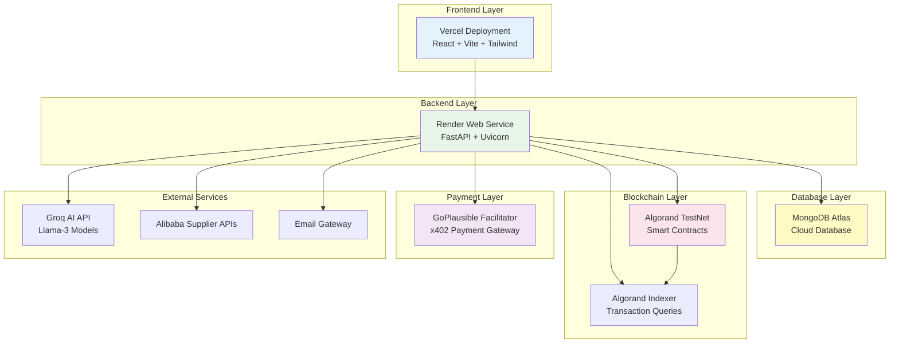

# ProcureAI Deployment Guide

This document outlines the step-by-step instructions to deploy ProcureAI into production environments.

---

## Deployment Architecture Overview

**Production Deployment Architecture:**

**Development Environment:**
- Frontend: `npm run dev` (Vite dev server)
- Backend: `uvicorn main:app --reload`
- Smart Contracts: `algokit compile python`

**Production Environment:**
- Frontend: Vercel deployment
- Backend: Containerized FastAPI on Render
- Database: MongoDB Atlas
- Blockchain: Algorand TestNet
- Payment: GoPlausible hosted facilitator

* **Frontend**: React + Vite + Tailwind CSS deployed on **Vercel**.
* **Backend**: FastAPI (Python) web server deployed on **Render** (via Web Service).
* **Database**: MongoDB database hosted on **MongoDB Atlas** (Cloud Database).
* **Smart Contracts / Blockchain**: Python ARC-4 contract deployed to the **Algorand TestNet**.

---

## Environment Variables Reference

To successfully launch the services, the following environment variables must be defined:

| Service | Environment Variable | Purpose | Example Value / Source |
|---|---|---|---|
| **AI Sourcing** | `GROQ_API_KEY` | Connects Groq Llama-3 agent for supplier negotiations | Get from [Groq Console](https://console.groq.com/) |
| **Sourcing API** | `RAPIDAPI_KEY` | Alibaba sourcing search integration API key | Get from [RapidAPI](https://rapidapi.com/) |
| **Sourcing API** | `RAPIDAPI_HOST` | Alibaba sourcing search host domain | `alibaba-datahub.p.rapidapi.com` |
| **Blockchain** | `MNEMONIC` | 25-word secret mnemonic key for Algorand TestNet deployments | Generated from Algorand Wallet or CLI |
| **Blockchain** | `ALGOD_ADDRESS` | Connection endpoint for the Algorand Node client | `https://testnet-api.algonode.cloud` |
| **Database** | `MONGO_URI` | MongoDB Connection String URL | `mongodb+srv://<user>:<password>@cluster0.mongodb.net/procure_ai` |
| **Database** | `MONGO_DB_NAME` | Name of the MongoDB database | `procure_ai` |
| **Mail Server** | `SMTP_EMAIL` | Credentials for sending RFQ notifications to suppliers | e.g. `your-email@gmail.com` |
| **Mail Server** | `SMTP_PASSWORD` | App-specific password for SMTP server authorization | Google App Password |
| **Server** | `RELOAD` | Enables or disables uvicorn code reloading | `False` (for production) |

---

## Deployment Instructions

### 1. Database Setup: MongoDB Atlas
1. Create a free-tier cluster at [MongoDB Atlas](https://www.mongodb.com/cloud/atlas).
2. Create a database user with read/write privileges.
3. Whitelist access from all IPs (`0.0.0.0/0`) since Render web service IPs change dynamically.
4. Copy the connection string (with your username and password) and set it as `MONGO_URI`.

### 2. Blockchain Setup: Algorand TestNet Account
1. Generate an account mnemonic using Algokit or any Algorand Wallet.
2. Fund the generated address with Test ALGOs from the [Algorand TestNet Faucet](https://bank.testnet.algorand.network/).
3. Use the address as the `DEPLOYER` address, and the 25-word key as `MNEMONIC`.

### 3. Backend Setup: Render Web Service
1. Create a new **Web Service** on [Render](https://render.com/).
2. Connect your Git repository.
3. Configure the build parameters:
   * **Runtime**: `Python`
   * **Build Command**: `pip install -r backend/requirements.txt`
   * **Start Command**: `python backend/main.py`
4. Add all environment variables listed in the reference table under the Render settings page. Make sure `RELOAD=False` is set to ensure optimal production performance.

> [!TIP]
> Ensure Render's health check is pointing to the `/health` endpoint to monitor liveness.

### 4. Frontend Setup: Vercel
1. Link your repository to a new project on [Vercel](https://vercel.com/).
2. Set the build parameters:
   * **Build Command**: `npm run build`
   * **Output Directory**: `dist`
3. Add the env variable:
   * `VITE_API_URL`: pointing to your deployed Render URL (e.g. `https://procure-ai-backend.onrender.com`).
4. Click **Deploy**. Vercel will build and serve your static frontend with an SSL certificate automatically.
