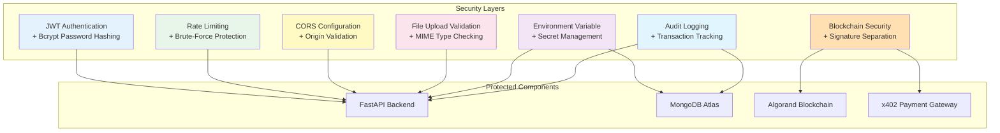

# ProcureAI Security Documentation

This document describes security policies, access controls, and security implementations for ProcureAI.

---

## Security Features Overview

ProcureAI implements security measures across all layers:

---

## Current Security Implementations

### 1. Password Hashing (Bcrypt)
Passwords are encrypted using bcrypt before storage.
* **Algorithm**: Blowfish-based key derivation with dynamic salt.
* **Storage**: Plaintext passwords are never stored. Login credentials are checked against bcrypt hashes.

### 2. JWT Authentication
ProcureAI uses JWT authentication for backend security.
* **Token Structure**: Tokens include 30-minute expiration and user identifier.
* **Validation**: FastAPI validates signatures and expirations for protected routes.

### 3. Rate Limiting
Rate limits prevent brute-force and DoS attacks.
* **Mechanism**: Uses `slowapi` to track clients by IP.
* **Limits**:
  * **Auth**: `/api/login` and `/api/signup` limited to `5 requests/minute`.
  * **API**: Escrow and supplier routes capped at `20-30 requests/minute`.

### 4. File Upload Validation
File uploads are sanitized to prevent exploits.
* **MIME Check**: Only `image/png`, `image/jpeg`, and `application/pdf` allowed.
* **Extension Check**: Only `.jpg`, `.jpeg`, `.png`, and `.pdf` accepted.
* **Sanitization**: Filenames are remapped using `escrow_id` and timestamps.

### 5. CORS Configuration
Backend access is restricted to trusted origins.
* **Allowed Origins**: Set via `ALLOWED_ORIGINS` environment variable.
* **Credentials**: Disabled by default unless explicitly enabled.

### 6. Environment Variables
Keys and secrets are separated from code.
* **Mnemonic**: Loaded at runtime only.
* **Database**: MongoDB URIs managed via environment variables.
* **Git**: `.gitignore` prevents `.env` files from being committed.

### 7. Signature Separation (x402)
The x402 protocol uses signature separation:
* **Buyer**: Signs only payment transaction (Tx0) via Pera Wallet
* **Facilitator**: Signs fee transaction (Tx1) and broadcasts
* **Verification**: Server confirms on-chain settlement before unlocking resources
* **Replay Protection**: Transaction IDs tracked to prevent replay attacks

### 8. Audit Logging
Tracks all critical operations:
* **User Actions**: Login, signup, procurement, escrow management
* **Transactions**: Blockchain transactions, settlements, reputation updates
* **Security Events**: Failed auth, rate limit violations, suspicious activity
* **Logs**: Append-only with timestamps

---

## Future Security Plans

Planned security improvements:

### 1. Role-Based Access Control (RBAC)
* **Plan**: Define user scopes (buyer, supplier, admin).
* **Details**: Check JWT scopes to restrict critical endpoints.

### 2. Escrow Signature Handshake
* **Plan**: Require double signature verification.
* **Details**: Both buyer and supplier sign messages verified on-chain before updates.

### 3. Multi-Factor Authentication (MFA)
* **Plan**: Optional MFA for high-value transactions
* **Details**: TOTP or hardware key support for escrow releases

### 4. Real-time Threat Detection
* **Plan**: Anomaly detection and automated response
* **Details**: Pattern recognition for unusual transactions and behavior

### 5. Security Dashboard
* **Plan**: Real-time security monitoring
* **Details**: Centralized dashboard for metrics and incident response
